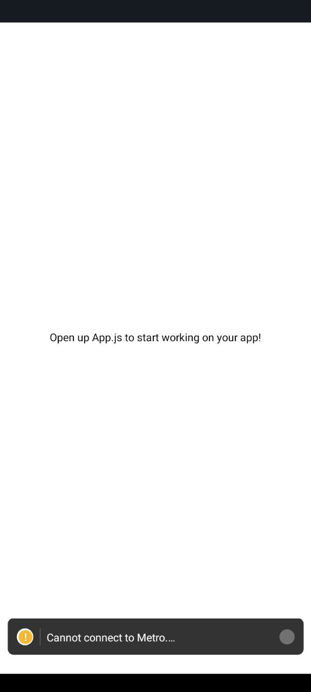

## Student ID
11256031

## Description
In this project, a new React Native application was created using the Expo CLI with a blank template. The primary modifications were made in the App.js file. The background color of the main view component was customized, and a text component was modified to display the actual name of the student. The font size of the text was increased to 24 for better readability, and the student’s name was highlighted by making it bold.

## Screenshots

